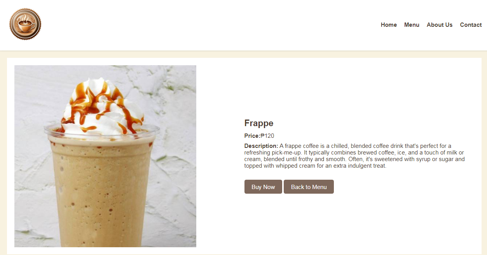
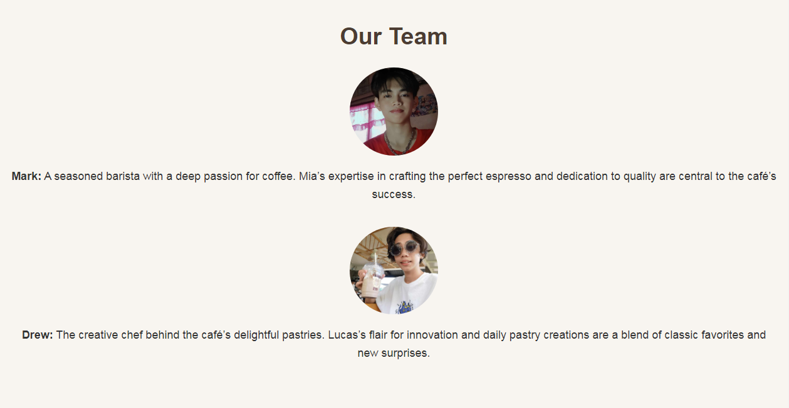
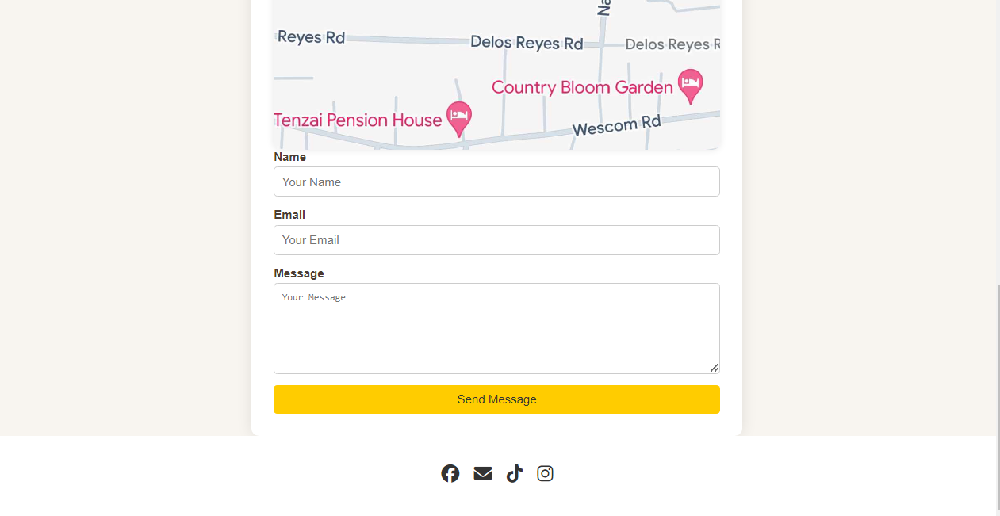

# Cozy Cup Cafe
## Project Description
Welcome to Cozy Cup Cafe, the best and comfiest destination for relaxation, vibes and ambiance,
Our website makes it easy to order your favorite coffee drinks and freshly baked treats. 
Just browse our menu. Take a break and indulge in delicious flavors from  Cozy Cup Cafe today!

---

## Features
-Homepage: We showcase our best-selling coffee drinks and pastries with real product images that you would die for.

-Menu Page: You can explore all our offerings in detail, including descriptions and prices.

-About Page: Learn the story behind it all, follow our journey on how Cozy Cup Cafe came to be

-Contact Page: Get in touch with us through our address, phone number, and email for any inquiries.

-Embedded Google Maps: Find us easily with our location on Google Maps, so you know exactly where to visit.

---
## Screen Captures

> Showcases our best-selling coffee drinks and pastries with vibrant images and descriptions.

---

> Displays all our offerings, including details, prices, and customization options.

---

> Highlights our story, mission, and what makes Coffee Break special.

---

> Provides our address, phone number, and email for easy contact.

---

## About the Authors

### **Mark Silwyn D. Jardin**

> *202280233@psu.palawan.edu.ph*@gmail.com**

**Social Links**

> [![Facebook Account] [![Github Account]

### **Drew Jhone M. Wakefield**

> **202280185@psu.palawan.edu.ph**

**Social Links**

> [![Facebook Account] [![Github Account]<img src="facebook.png" width="150"(Facebook Account)](https://github.com/Curiouscat21)
